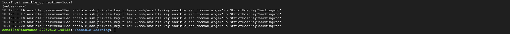

# 🚀 Ansible + Terraform Project – Automate Nginx on GCP VMs

This project demonstrates how to use **Terraform** to provision infrastructure and **Ansible** to automate server configuration (installing Nginx) on **Google Cloud Platform (GCP)**.

---

## ⚙️ Step 0: Provisioned 5 GCP VMs Using Terraform

Before starting Ansible automation, we used **Terraform** to create 5 virtual machines on GCP.

### ✅ Terraform Project Structure:
```
Terraform/
├── main.tf
├── variables.tf
├── outputs.tf
├── terraform.tfvars
└── modules/
    └── vm-instance/
        ├── main.tf
        ├── variables.tf
        └── outputs.tf
```

### ✅ Commands Used:
```bash
terraform init
terraform apply
```

---

## 📦 Objective

Use Ansible to automate the following on all VMs:
- Install **Nginx**
- Ensure the **service is running and enabled**
- Deploy a **custom HTML homepage**
- Connect using **SSH key-based access**

---

## ✅ Step-by-Step Implementation

---

### 1️⃣ Installed Ansible on the Host Machine (Control Node)

```bash
sudo apt update
sudo apt install ansible -y
ansible --version
```

---

### 2️⃣ Created the Ansible Inventory File (`inventory.ini`)

```ini
[webservers]
10.128.0.16 ansible_user=cena18ed ansible_ssh_private_key_file=~/.ssh/ansible-key ansible_ssh_common_args='-o StrictHostKeyChecking=no'
10.128.0.17 ...
10.128.0.18 ...
```

📸 Screenshot:



---

### 3️⃣ Wrote the Ansible Playbook to Install Nginx

📁 Saved as: `install-nginx.yml`

```yaml
- name: Install and start Nginx web server
  hosts: webservers
  become: true
  tasks:
    - name: Update APT package index
      apt:
        update_cache: yes

    - name: Install Nginx
      apt:
        name: nginx
        state: present

    - name: Ensure Nginx is running
      service:
        name: nginx
        state: started
        enabled: yes

    - name: Create a custom homepage
      copy:
        content: "<h1>Hello from Ansible Nginx!</h1>"
        dest: /var/www/html/index.html
```

---

### 4️⃣ Ran the Playbook and Deployed Nginx

#### ✅ Command:
```bash
ansible-playbook -i inventory.ini install-nginx.yml
```

#### 🔍 What It Did:
- Connected to each VM
- Updated apt cache
- Installed and enabled Nginx
- Added a custom HTML homepage

📸 Screenshot (optional):


---

### 5️⃣ Final Validation and Results

#### 🧪 Validate With:
```bash
curl http://localhost
```

✅ Expected Output:
```html
<h1>Hello from Ansible Nginx!</h1>
```

You can also run:
```bash
systemctl status nginx
```

✅ Should say: `active (running)`

📸 Screenshot (optional):


---

## ✅ Project Outcome

- Used Terraform to provision 5 VMs in GCP
- Configured key-based SSH access
- Automated setup of Nginx using Ansible
- Verified full deployment using CLI tools

---

## 📌 Next Steps

- Add roles and handlers in Ansible
- Integrate with CI/CD (GitHub Actions)
- Store inventory dynamically using Terraform outputs
- Use Load Balancer + reverse proxy config in Nginx

---

**Built by:** cena18ed  
**Stack:** Terraform, Ansible, GCP, Linux  
